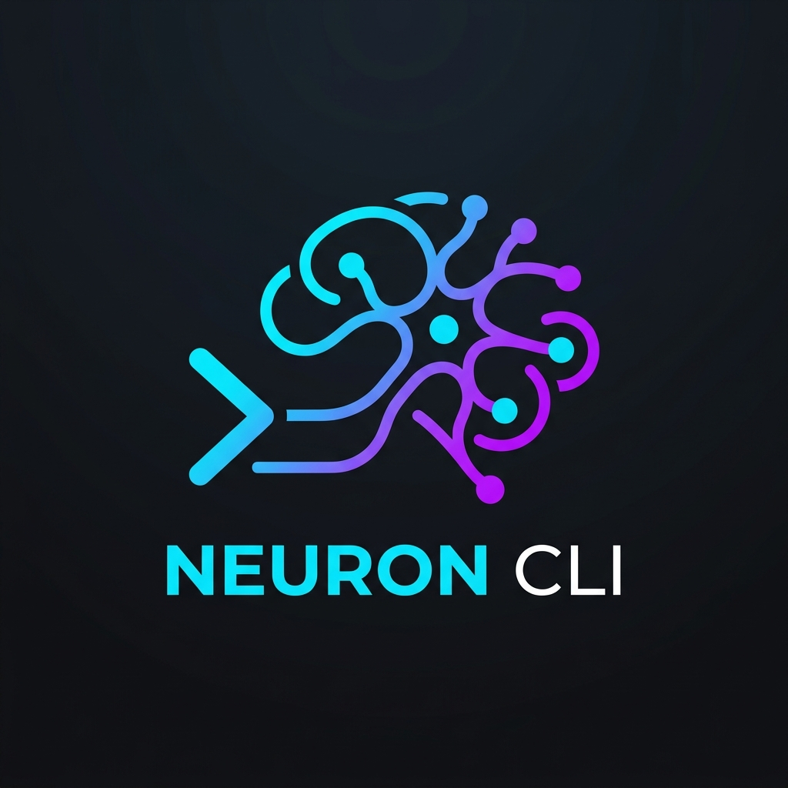

<div align="center">

<h1>Neuron CLI</h1>

**Tus notas son texto plano. ¿Por qué gestionarlas tiene que sentirse tan pesado?**

*Si te gusta Neuron CLI, ¡considera apoyarlo con una ⭐ en GitHub!*

[English](README.md) | [Español]
</div>

<br>

> Neuron es un gestor de notas local-first y compatible con Obsidian, diseñado para la terminal. Mantiene tu bóveda de Markdown exactamente donde está: sin migraciones, sin bases de datos propietarias y sin suscripciones en la nube. Solo acceso ultrarrápido y guiado por teclado a tus pensamientos desde cualquier parte de tu shell.

---

### ¿Por qué otro gestor de notas?

Si eres como yo, pasas el día en la terminal y guardas tus notas en archivos Markdown planos. Pero la mayoría de herramientas de notas se sienten demasiado pesadas: requieren interfaces llenas de clics, corren sobre frameworks Electron que consumen recursos, o intentan amarrar tus datos a una suscripción de sincronización en la nube.

Neuron está construido de otra manera:
* **Cero bloqueo de datos (Lock-in):** Trabaja directamente con tu directorio local de archivos Markdown. Puedes abrirlos en Obsidian, VS Code o Vim en cualquier momento.
* **Velocidad sin fricciones:** Abre, busca, crea y organiza notas en milisegundos usando atajos de teclado optimizados.
* **Listo para IA:** Realiza consultas a tu bóveda usando inteligencia artificial local (vía Ollama) o expón tus notas a agentes de IA mediante el servidor integrado de Model Context Protocol (MCP).

---

### ¿Por qué Neuron? (Filosofía)

* **El teclado manda:** Tus manos nunca deberían dejar la fila inicial del teclado (home row). Cada acción —desde buscar notas hasta mover carpetas y copiar bloques de código— está a un atajo de distancia.
* **Privacidad por defecto:** Tus pensamientos son tuyos. Neuron funciona 100% offline. No te rastrea, no sube tus notas a internet y no requiere que crees una cuenta.
* **Libertad de formato:** Creemos que Markdown plano con frontmatter YAML estándar es la mejor manera de ser dueño de tus notas. Si mañana decides dejar de usar Neuron, tus notas seguirán siendo simples archivos de texto legibles por cualquier editor.

---

### Inicio Rápido

Ponte en marcha con solo tres comandos:

1. **Instala Neuron:**
   ```bash
   brew install steevin/tap/neuron
   ```
2. **Inicializa tu Bóveda:**
   ```bash
   neuron init
   ```
   *Apunta Neuron a un directorio existente de Obsidian o crea una bóveda desde cero.*
3. **Inicia la TUI:**
   ```bash
   neuron
   ```
   *Presiona `?` dentro de la interfaz para ver todos los atajos disponibles.*

---

### Instalación

Opciones detalladas para instalar Neuron:

```bash
# Homebrew (macOS y Linux)
brew install steevin/tap/neuron

# Binario mediante curl
curl -sSfL https://github.com/steevin/neuron-cli/releases/latest/download/neuron_$(uname -s)_$(uname -m).tar.gz | tar -xz -C /usr/local/bin neuron

# Go (requiere Go instalado)
go install github.com/steevin/neuron-cli@latest

# Desde el código fuente
git clone https://github.com/steevin/neuron-cli && cd neuron-cli && make build
```

---

### Características

#### Organiza sin pensar (PARA)
Neuron entiende la metodología **Projects · Areas · Resources · Archive** (PARA) de manera nativa. Escanea las carpetas de tu bóveda y te ayuda a mantener el orden sin interrumpir tu flujo de trabajo:
* **Selector de carpetas inteligente:** Al crear una nota (`n` o `neuron add`), un menú interactivo te pide elegir la carpeta de destino. Olvídate de acumular notas sueltas en la raíz de la bóveda.
* **Navegación fluida:** Muévete entre carpetas usando `← →` / `h l` o `↑ ↓` / `j k`. Presiona `Enter` para guardar o `Esc` para cancelar.
* **Movimiento rápido:** Usa `neuron move` o el comando `/move` en la TUI para reubicar cualquier nota al instante.
* *Bóvedas planas:* Si prefieres no usar el método PARA, el selector de carpetas se hace a un lado automáticamente.

#### Ubicación siempre visible (Breadcrumbs)
La barra de ruta (breadcrumbs) en la parte inferior de la TUI te muestra la ubicación exacta del archivo seleccionado (por ejemplo, `📂 1. Projects` o `📂 2. Areas/Finance`) mientras navegas por la lista.

#### Captura ideas al instante (Portapapeles)
* **Pegado instantáneo (`ctrl+v`):** Presiona `ctrl+v` sobre cualquier nota de la lista para añadir el contenido de tu portapapeles directamente al final del archivo en el disco. Ideal para guardar fragmentos web o logs sin abrir un editor.
* **Gestión inteligente de recursos:** Si tu portapapeles contiene la URL de una imagen o una ruta local, Neuron la copia automáticamente a la carpeta `assets/` de tu bóveda y crea el enlace Markdown por ti.
* **Pegado en bloque (Bracketed Paste):** Pega cualquier texto largo al ingresar el título de una nueva nota; Neuron usará la primera línea como título y el resto como contenido del archivo.

#### Búsqueda Dual
* **Búsqueda BM25:** Búsqueda clásica por palabras clave que responde tan rápido como escribes.
* **Búsqueda Semántica / IA:** Conecta Ollama en tu configuración para consultar tus notas por conceptos e ideas en lugar de palabras exactas (por ejemplo: `neuron list -q "muestrame cosas relacionadas con mi presupuesto"`).

#### Plantillas que te ahorran teclear
No escribas el frontmatter a mano. Crea plantillas reutilizables y úsalas al vuelo:
```bash
neuron add "2025-06-01 Standup" --template standup
neuron today                                        # Crea automáticamente la nota diaria usando tu plantilla personalizada
```

#### Conecta tus ideas
* **Wikilinks al estilo Obsidian:** Soporte completo para extracción e indexación de enlaces `[[wikilink]]`.
* **Etiquetas:** Los `#tags` dentro del texto de tus notas se indexan de forma automática para facilitar las búsquedas.
* **Resumen del Grafo:** Presiona `g` en la TUI para ver al instante el recuento de notas (nodos) y conexiones (enlaces) de tu grafo de conocimiento.

#### Formularios interactivos
Si olvidas pasar algún parámetro en la consola, Neuron no fallará con un error críptico. Te guiará a través de bonitos formularios interactivos construidos con `huh` para crear notas, elegir carpetas o confirmar acciones.

#### Temas
Alterna entre los temas oscuro (Tokyo Night) y claro (GitHub) en tiempo real usando el comando `/theme` en la TUI, o configúralo de forma permanente en los ajustes.

---

### Atajos de la TUI

Navega por Neuron rápidamente con estos atajos de teclado:

| Tecla | Acción |
|-----|--------|
| `j / k` o `↑ / ↓` | Navegar por la lista de notas |
| `Enter` | Seleccionar / confirmar |
| `Tab / Shift+Tab` | Cambiar el foco del panel (lista de notas ↔ previsualización) |
| `n` | Nueva nota (activa el selector de carpetas PARA) |
| `e` | Editar la nota seleccionada en `$EDITOR` |
| `ctrl+v` | Pegar el contenido del portapapeles al final de la nota |
| `c` / `y` | Copiar/extraer bloques de código de la nota seleccionada |
| `/` | Abrir la paleta de comandos (búsqueda interactiva) |
| `s` | Sincronizar con Git |
| `ctrl+g` | Resumen del grafo de conocimiento |
| `?` | Mostrar la ayuda de atajos |
| `q` | Salir |

**Durante la selección de carpeta (modo `📁 SAVE TO`)**

| Tecla | Acción |
|-----|--------|
| `← → / h l / ↑ ↓ / j k` | Navegar por las carpetas disponibles |
| `Enter` | Confirmar la carpeta elegida |
| `Esc` | Cancelar |

**Durante la extracción de código (modo `💻 COPY CODE`)**

| Tecla | Acción |
|-----|--------|
| `← → / h l / ↑ ↓ / j k` | Navegar por los bloques de código |
| `Enter` | Copiar el bloque seleccionado al portapapeles |
| `Esc` | Cancelar |

---

### Paleta de comandos

Busca comandos en cualquier momento desde la TUI presionando `/`:

| Comando | Descripción |
|---------|-------------|
| `/add <título>` | Crear una nueva nota (con selector de carpetas) |
| `/today` | Abrir o crear la nota diaria de hoy |
| `/edit`, `/e` | Abrir la nota seleccionada en `$EDITOR` |
| `/copy`, `/c` | Copiar la nota actual al portapapeles |
| `/attach <ruta_o_url>`| Descargar o copiar imagen a assets/ y enlazarla en la nota |
| `/links`, `/l` | Abrir el primer enlace de la nota en tu navegador |
| `/move <carpeta>` | Mover la nota seleccionada a una carpeta PARA |
| `/rm` | Eliminar la nota seleccionada |
| `/sync`, `/s` | Sincronizar con Git (pull y push opcional) |
| `/stats` | Mostrar estadísticas de la bóveda |
| `/open`, `/o` | Revelar la bóveda en Finder |
| `/theme dark\|light` | Cambiar el tema visual de la TUI en tiempo real |
| `/quit` | Salir de Neuron |

---

### Uso de la CLI

Cada comando está pensado para ser rápido e intuitivo:

```bash
neuron                                   # Abre la TUI (comportamiento por defecto)
neuron init                              # Asistente de configuración inicial
neuron add                               # Solicita título y muestra selector de carpetas
neuron add "standup notes" --tag work    # Crea nota con etiqueta y luego pide la carpeta
neuron add "1. Projects/API redesign"    # Salta el selector usando una ruta explícita
neuron add "Config" --file nginx.conf --code # Crea una nota directamente desde un archivo externo
cat script.py | neuron add "Script" --code python # Crea una nota con código de una tubería (pipe)
neuron edit "standup notes"             # Abre la nota en tu `$EDITOR`
neuron today                             # Abre o crea la nota diaria de hoy
neuron list -q "kubernetes"              # Búsqueda semántica o por texto plano
neuron move "standup notes" projects    # Mueve una nota a tu carpeta de Proyectos
neuron attach "standup notes" ./img.png # Adjunta una imagen o archivo local a una nota
neuron links "standup notes"             # Extrae y abre enlaces o imágenes en el navegador
neuron sync --pull                       # Sincroniza con git (pull + push)
neuron stats                             # Recuento de notas y etiquetas
neuron config set editor nvim            # Cambia el editor predeterminado
neuron config set theme dark             # Configura el tema permanente
neuron mcp                               # Inicia el servidor MCP
```

---

### Integración con Agentes de IA (MCP)

Neuron expone tu bóveda de notas como un servidor [Model Context Protocol (MCP)](https://modelcontextprotocol.io). Puedes agregarlo a clientes de IA compatibles (como Claude Desktop, Cursor o Antigravity) para darles acceso a tus notas:

```json
{
  "mcpServers": {
    "neuron": { "command": "neuron", "args": ["mcp"] }
  }
}
```

Una vez configurado, podrás pedirle a tu IA que busque, cree, resuma o mueva notas de tu bóveda sin necesidad de salir del chat.

---

### Formato de la Bóveda

Neuron utiliza Markdown puro con YAML frontmatter (exactamente igual que Obsidian). Apunta Neuron a tu directorio actual de Obsidian y funcionará de inmediato.

```markdown
---
title: Mi Nota
tags: [ideas, proyecto]
created: 2025-05-30T09:00:00Z
---

Contenido con [[wikilinks]] y #tags-internas.
```

**Estructura PARA recomendada** (Neuron autodetecta cualquier variante similar):

```
vault/
├── 1. Projects/
├── 2. Areas/
├── 3. Resources/
└── 4. Archive/
```

---

### Actualización de Neuron

Mantén tu instalación actualizada al último release:

```bash
# Homebrew
brew upgrade steevin/tap/neuron

# Binario mediante curl
curl -sSfL https://github.com/steevin/neuron-cli/releases/latest/download/neuron_$(uname -s)_$(uname -m).tar.gz | tar -xz -C /usr/local/bin neuron
```

---

### Apoyo al Proyecto

Crear y mantener herramientas de código abierto requiere tiempo y dedicación. Si Neuron hace que tu día a día en la terminal sea un poco más agradable, considera invitarme a un café o apoyar el desarrollo del proyecto:
[**Apoyar el proyecto ➔**](https://paypal.me/steevin)

---

### Licencia y Atribución

Neuron CLI es software libre bajo la licencia **GNU GPL v3**.

#### En pocas palabras:
* **Manténlo abierto:** Si modificas y distribuyes este código, tu versión también debe ser de código abierto bajo la misma licencia GPL v3.
* **Da crédito:** Por favor, mantén los avisos de copyright originales y la autoría de Daniel Steevin.
* **Muestra algo de cariño:** Si utilizas partes de este proyecto en una bifurcación pública, añade una mención en el README apuntando hacia Neuron CLI. ¡Ayuda mucho a hacer crecer el proyecto!

---

### Contacto

Para soporte, comentarios, consultas comerciales o cualquier otra duda, puedes escribirme a:
[**neuron@steevin.com**](mailto:neuron@steevin.com)

---

<div align="center">
Creado por Daniel Steevin
<br>
Distribuido bajo la <a href="LICENSE">Licencia GNU GPL v3</a> — Código abierto con Copyleft.
</div>
