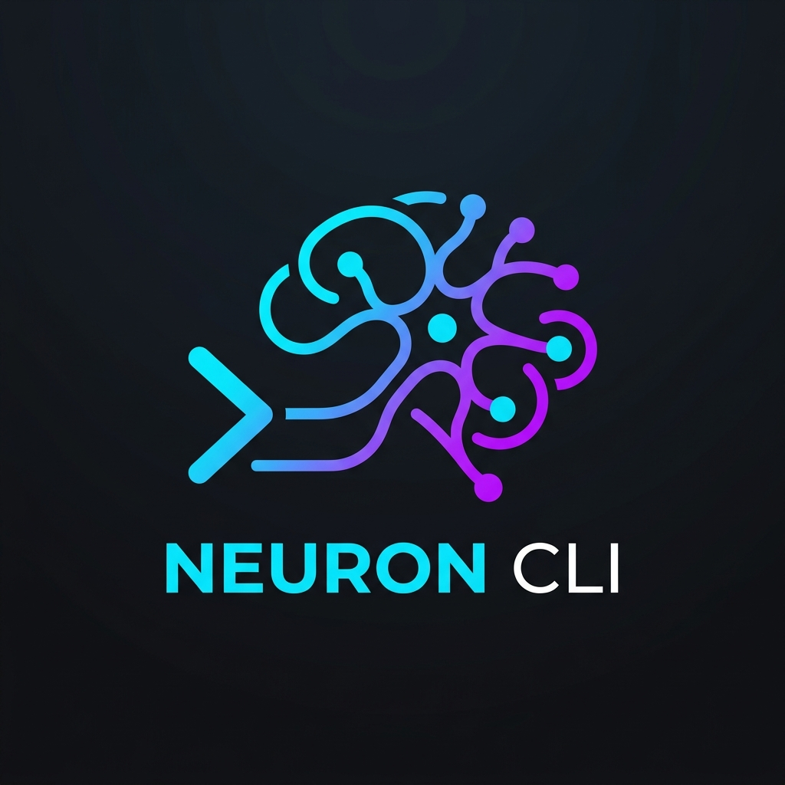

<div align="center">



# Neuron CLI

**Captura ideas. Encuentra tu siguiente tarea. Retoma donde te quedaste.**

Un espacio de trabajo Markdown local para tu terminal, compatible con Obsidian.

**Local primero** · **Control por teclado** · **Archivos Markdown** · **IA y MCP opcionales**

[Inicio rápido](#inicio-rápido) · [Interfaz web](#interfaz-web-local) · [Flujos de trabajo](#flujos-de-trabajo) · [Comandos](#referencia-de-comandos) · [English](README.md)

</div>

---

| Captura | Avanza | Retoma |
| :--- | :--- | :--- |
| Guarda una idea en **Inbox** sin abrir un editor. | Revisa tus **tareas** Markdown y el resumen diario. | Abre el **contexto del proyecto** vinculado a tu repositorio. |
| `neuron capture "Una idea"` | `neuron dashboard` | `neuron project` |

Tu bóveda sigue siendo una carpeta de archivos Markdown. Edita las mismas notas
con Neuron, Obsidian o tu editor favorito. Los flujos principales funcionan
localmente; la IA, los adjuntos remotos y los remotos Git son opcionales.

> **Versión en desarrollo:** los comandos de productividad están implementados en
> este repositorio. El paquete publicado puede ir por detrás. Compila esta copia
> con `go build -o bin/neuron ./cmd/neuron` y usa `./bin/neuron` en lugar de `neuron`.

## Inicio rápido

```bash
brew install steevin/tap/neuron
neuron init
neuron
```

Elige una bóveda existente o crea una durante la configuración. En la interfaz
de terminal (TUI), pulsa **`?`** para ver atajos, **`/`** para la paleta y **`e`** para editar.

<details>
<summary><strong>Otras opciones de instalación y actualización</strong></summary>

**Desde el código fuente** — requiere Go 1.26.3 o posterior, según `go.mod`:

```bash
git clone https://github.com/steevin/neuron-cli.git
cd neuron-cli
go build -o bin/neuron ./cmd/neuron
./bin/neuron init
```

**Con Go** — instala el comando publicado en el directorio de binarios de Go:

```bash
go install github.com/steevin/neuron-cli/cmd/neuron@latest
```

**Binarios:** elige tu sistema y arquitectura en la
[página de releases](https://github.com/steevin/neuron-cli/releases).
Los archivos siguen el formato `neuron_<version>_<os>_<arch>.tar.gz`
(`.zip` en Windows); los releases incluyen sumas de verificación.

**Actualizar:** usa `brew upgrade steevin/tap/neuron`, repite la instalación con
Go o descarga un release más reciente. Las compilaciones locales deben
reconstruirse después de actualizar el código.

</details>

## Flujos de trabajo

```text
Captura → Revisa Inbox → Avanza con tus tareas → Retoma tu proyecto
                         neuron dashboard
```

### 1 · Captura ahora, organiza después

```bash
neuron capture "Investigar timeout de la API"
printf 'Revisar API\n- [ ] Reproducir el timeout\n' | neuron capture
neuron inbox
neuron inbox file "Inbox/revisar-api.md" "1. Projects"
```

La captura escribe en `Inbox/` sin formularios ni editor. La primera línea sirve
como título y todo el texto se conserva en el cuerpo. El comando muestra la ruta
guardada; repetir un título crea otra nota. Usa la ruta de `neuron inbox` para
clasificar una nota en su carpeta de destino.

### 2 · Trabaja con las tareas en sus notas

```bash
neuron tasks
neuron tasks --all --folder "1. Projects"
```

Las tareas se extraen de casillas Markdown como `- [ ] Reproducir el timeout`.
Cada resultado muestra la ruta relativa a la bóveda y la línea real del archivo.

```bash
# Sustituye 10 por la línea que muestre neuron tasks.
neuron tasks done "1. Projects/revisar-api.md" 10
neuron tasks reopen "1. Projects/revisar-api.md" 10
neuron tasks open "1. Projects/revisar-api.md" 10
```

Completar cambia únicamente la casilla. Se excluyen tareas vacías, frontmatter
y ejemplos dentro de bloques de código cercados. `tasks open` abre la nota
completa en tu editor. Después de editarla, vuelve a listar las tareas para
obtener los números de línea actuales.

### 3 · Empieza con un resumen diario

```bash
neuron dashboard --limit 5
neuron today
```

El dashboard muestra **pendientes · Inbox · proyectos vinculados · notas recientes**,
con un límite por sección. Es una vista de consulta de toda la bóveda; las tareas
no se filtran por vencimiento. `today` abre o crea `Daily YYYY-MM-DD` en tu editor,
usando la plantilla diaria cuando existe.

### 4 · Conserva el contexto de tu repositorio

Ejecuta dentro de un repositorio Git:

```bash
neuron project init --name "Rediseño API"
neuron project
neuron project list
```

La nota incluye secciones para **objetivo**, **siguientes pasos**, **decisiones**
y **notas relacionadas**. `neuron project` también funciona desde subcarpetas
del repositorio.

```bash
neuron project link "1. Projects/revisar-api.md"
neuron project unlink
```

Vincular reemplaza la asociación anterior del repositorio. Desvincular la retira
del dashboard sin borrar la nota. Los proyectos vinculados se consideran activos;
las rutas de repositorios corresponden a esta máquina.

### 5 · Guarda las búsquedas que repites

```bash
neuron search 'timeout tag:work folder:"1. Projects"'
neuron search save trabajo 'tag:work folder:"1. Projects"'
neuron search list
neuron search run trabajo
neuron list --saved trabajo --limit 0
neuron list -q timeout --tag work --folder "1. Projects"
```

Los filtros se combinan con **AND**; `folder:` incluye subcarpetas. Usa comillas
para valores con espacios, como en el ejemplo. Guardar con un nombre existente
reemplaza su consulta. `neuron search remove trabajo` borra la búsqueda y conserva
las notas.

| Modo de búsqueda | Comportamiento |
| :--- | :--- |
| `neuron search '<consulta>'` | BM25 local con filtros opcionales `tag:` y `folder:` |
| `neuron list --saved trabajo` | Consulta guardada; admite filtros adicionales |
| `neuron list -q '<texto>'` sin filtros | BM25 por defecto; semántica si la IA está habilitada |
| `neuron search run trabajo` | Hasta 50 resultados; usa `list --saved trabajo --limit 0` para ver todos |

Estos cinco flujos se ejecutan en la **shell**, no como `/comandos` dentro de la TUI.

## Interfaz web local

```bash
neuron web
```

Abre automáticamente el navegador con la bóveda configurada. La web está incluida
en el binario: no necesita Node.js, instalaciones adicionales ni servicios de hosting.

| Vista | Qué puedes hacer |
| :--- | :--- |
| Biblioteca | Navegar por carpetas y etiquetas; alternar lista y tarjetas |
| Búsqueda | Buscar palabras en títulos y en todo el contenido de las notas |
| Editor | Crear notas con carpeta y etiquetas; editar su cuerpo en Markdown |
| Lectura / Escribir / Ambos | Leer, editar o trabajar con previsualización |
| Conexiones | Abrir `[[wikilinks]]`, enlaces Markdown a notas y backlinks |
| Grafo de ideas | Abrir notas desde el mapa, acercar, alejar y desplazarlo |
| Hoy | Abrir la nota diaria existente o crear una desde la web |
| Tema | Alternar entre claro y oscuro |

**Modos de edición:** **Escribir** permite editar el código Markdown; **Lectura**
muestra el resultado formateado sin editarlo; **Ambos** combina el editor Markdown
y la previsualización. El editor visual tipo Word o Notion (WYSIWYG) todavía no
está implementado. Las notas siempre se guardan como archivos `.md`.

**Guardado:** los cambios se guardan al dejar de escribir durante un segundo.
También puedes pulsar Guardar o `⌘/Ctrl S`. Se conserva el frontmatter del archivo.
La web comprueba los cambios externos cada cuatro segundos: actualiza las notas
sin editar y, si existe un borrador en conflicto, permite comparar ambas versiones,
guardar el borrador como otra nota o recargar desde disco. Un borrador sin guardar
vive en la pestaña; mantenla abierta hasta resolver el conflicto o guardar.

```bash
neuron web --port 7878
neuron web --vault /ruta/a/tu/boveda --no-open
```

El puerto se elige automáticamente por defecto. `--no-open` imprime el enlace de
sesión para abrirlo manualmente. El servidor escucha solo en `127.0.0.1`; conserva
la terminal abierta y pulsa `Ctrl+C` para detenerlo. El enlace de sesión da acceso
a esta bóveda mientras el servidor esté activo; usa el enlace nuevo tras reiniciarlo.

**Atajos:** `⌘/Ctrl K` busca, `⌘/Ctrl N` crea una nota y `⌘/Ctrl S` guarda.

La previsualización admite tablas, bloques de código, casillas e imágenes locales
PNG, JPEG, GIF, WebP y AVIF. No ejecuta HTML de las notas ni carga imágenes remotas.
La web omite archivos ocultos y enlaces simbólicos en la biblioteca; acepta notas
hasta 4 MiB e imágenes hasta 50 MiB. El grafo muestra las 150 notas más recientes;
en mapas densos, enfoca o pasa el cursor sobre un nodo para ver su título.
Los wikilinks ambiguos requieren localizar la nota por búsqueda. La nota diaria
creada desde la web usa un cuerpo básico; `neuron today` conserva el flujo CLI
con plantillas personalizadas.

## Interfaz de terminal

Explora notas con previsualización, rutas visibles, temas claro/oscuro y paleta
de comandos. Edita en tu editor configurado, pega texto del portapapeles en la
nota seleccionada o copia sus bloques de código sin abrir el editor.

| Tecla | Acción |
| :--- | :--- |
| `j / k` o `↑ / ↓` | Navegar por las notas |
| `Tab / Shift+Tab` | Cambiar el foco entre paneles |
| `n` | Crear una nota; elegir destino si se detectan carpetas PARA |
| `e` | Editar la nota seleccionada |
| `ctrl+v` | Añadir el portapapeles al final de la nota |
| `c / y` | Seleccionar y copiar un bloque de código |
| `/` | Buscar notas o escribir un comando de la paleta |
| `s` | Sincronizar con Git |
| `ctrl+g` | Ver conteos del grafo; no es un grafo interactivo |
| `?` | Mostrar u ocultar la ayuda de atajos |
| `q` | Salir |

<details>
<summary><strong>Paleta de comandos y controles de selección</strong></summary>

| Comando | Acción |
| :--- | :--- |
| `/add <título>` | Crear nota; `/add carpeta/título` indica su carpeta |
| `/today`, `/t` | Seleccionar o crear la nota diaria |
| `/edit`, `/e` | Abrir la nota en tu editor |
| `/copy`, `/c` | Copiar la nota completa |
| `/attach <ruta_o_url>`, `/a` | Copiar o descargar un adjunto |
| `/links`, `/l` | Abrir un enlace; elegir uno cuando hay varios |
| `/move <carpeta>`, `/m` | Mover la nota seleccionada |
| `/rm` | Eliminar la nota seleccionada |
| `/sync`, `/s` | Sincronizar con Git |
| `/stats` | Mostrar conteos de notas y etiquetas |
| `/doctor`, `/health` | Mostrar un resumen de salud |
| `/backlinks` | Mostrar un resumen de enlaces entrantes |
| `/orphan` | Mostrar conteos y ejemplos de notas aisladas |
| `/open`, `/o` | Abrir la bóveda en el explorador de archivos |
| `/theme dark\|light` | Cambiar el tema; `/theme` lo alterna |
| `/help`, `/?` | Mostrar la ayuda de atajos |
| `/quit`, `/q` | Salir |

Al seleccionar carpetas, enlaces o bloques de código, usa las flechas o `h/j/k/l`,
`Enter` para confirmar y `Esc` para cancelar.

</details>

## Referencia de comandos

Usa `neuron <comando> --help` para consultar opciones y ejemplos, también en
subcomandos como `neuron tasks done --help`.

| Propósito | Comandos |
| :--- | :--- |
| Configuración e interfaz | `init`, `tui`, `web`, `config get`, `config set`, `completion`, `version` |
| Captura y trabajo diario | `capture`, `inbox`, `inbox file`, `dashboard`, `today` |
| Tareas Markdown | `tasks`, `tasks done`, `tasks reopen`, `tasks open` |
| Contexto de repositorios | `project`, `project init`, `project link`, `project list`, `project unlink` |
| Búsqueda y favoritos | `list`, `search`, `search save`, `search list`, `search run`, `search remove` |
| Notas y adjuntos | `add`, `edit`, `move`, `rm`, `attach`, `links`, `open` |
| Conexiones y mantenimiento | `backlinks`, `orphan`, `timeline`, `stats`, `doctor`, `restore`, `sync` |
| Acceso para agentes | `mcp` |

<details>
<summary><strong>Comandos habituales para notas</strong></summary>

```bash
neuron add "Standup" --folder "1. Projects" --tag work
neuron add "Standup" --template standup
neuron add "Config" --file nginx.conf --code --no-edit
cat script.py | neuron add "Script" --code python
neuron edit "Standup"
neuron move "Standup" "1. Projects"
neuron attach "Standup" ./imagen.png
neuron links "Standup"
neuron backlinks "Standup"
neuron timeline --created
neuron restore --list
neuron restore "Nota antigua" --folder "4. Archive"
neuron doctor
neuron sync --pull
neuron sync --remote backup
```

`neuron add` sin título solicita título y carpeta. Si pasas un título, indica
`--folder` explícitamente: la CLI no interpreta `carpeta/título` como destino.
Los comandos anteriores de notas aceptan ID o título; los de productividad
admiten además rutas relativas a la bóveda. Los adjuntos usan la carpeta
configurada en Obsidian o `assets/`, con un límite de 50 MiB para descargas remotas.

</details>

## Configuración y bóveda

Los ajustes están en `~/.config/neuron/config.toml`:

```bash
neuron config get vault_path
neuron config set editor "code -w"
neuron config set theme dark
neuron config set git_remote origin
```

Claves admitidas por `config get/set`: `vault_path`, `editor`, `theme`, `git_remote`.
El editor admite argumentos. Las carpetas PARA son opcionales:

```text
vault/
├── Inbox/                 Notas capturadas
├── 1. Projects/           Notas de proyectos
├── 2. Areas/
├── 3. Resources/
├── 4. Archive/
├── templates/             Plantillas Markdown reutilizables
└── .neuron/               Metadatos e índices locales
    └── workspace.json     Búsquedas guardadas y vínculos a repositorios
```

Las notas son Markdown con frontmatter YAML opcional, `[[wikilinks]]` y `#tags`.
Las notas creadas o movidas permanecen dentro de la bóveda. Las eliminadas van
a `.trash`. Los metadatos de proyectos y búsquedas se guardan aparte del contenido.

<details>
<summary><strong>Plantillas y búsqueda semántica opcional</strong></summary>

Guarda `standup.md` o `daily.md` en `.obsidian/templates/` o `templates/` dentro
de la bóveda; se buscan en ese orden. Admiten variables de las plantillas de Go:

```markdown
# {{.Title}}
Fecha: {{.Date}}

## Siguientes pasos
- [ ] Definir la siguiente acción
```

La IA es opcional. Edita la sección `[ai]` existente en `config.toml` para usar
Ollama; el modelo debe estar disponible en el servidor configurado:

```toml
[ai]
enabled = true
provider = "ollama"
model = "nomic-embed-text"
ollama_url = "http://localhost:11434"
```

Ejecuta `neuron list -q "ideas relacionadas con mi presupuesto"`. Las búsquedas
con filtros y `neuron search` siguen usando BM25 local. El código también admite
un proveedor de embeddings de OpenAI; seleccionar un proveedor remoto envía a
ese servicio el contenido usado para generar embeddings. Los ajustes de IA se
editan en TOML, no mediante `neuron config set`.

</details>

## Acceso para agentes de IA · MCP

Configura un cliente compatible con MCP para iniciar Neuron mediante stdio:

```json
{
  "mcpServers": {
    "neuron": {
      "command": "neuron",
      "args": ["mcp", "--read-only"]
    }
  }
}
```

El servidor expone `search_notes`, `get_note`, `create_note`, `update_note`,
`list_notes` y `get_daily`. Quita `--read-only` para permitir escrituras. En modo
solo lectura, `get_daily` puede leer una nota diaria existente, pero no crearla. MCP todavía
no expone herramientas de proyectos, tareas, movimiento o búsquedas guardadas.

```bash
neuron mcp --vault /ruta/absoluta/a/la/boveda --read-only
neuron mcp --audit-log ~/.local/state/neuron/mcp-audit.jsonl
```

## Ayuda y alcance actual

| Si… | Prueba… |
| :--- | :--- |
| Falta un comando nuevo | Compila esta copia y ejecuta `./bin/neuron --help` |
| Una búsqueda no encuentra nada | Revisa `neuron config get vault_path` y reduce los filtros |
| No puedes actualizar una tarea | Ejecuta `neuron tasks --all` y usa su ruta y línea actuales |
| Un proyecto no tiene contexto | Dentro del repositorio, ejecuta `neuron project init` o `project link <nota>` |
| Falla el editor | Revisa `neuron config get editor` y configura un editor instalado |
| Necesitas revisar la bóveda | Ejecuta `neuron doctor` y `neuron restore --list` |

**Alcance actual:** la web permite explorar, crear y editar el cuerpo de las notas.
El frontmatter existente se conserva; renombrar, mover y eliminar notas sigue
haciéndose desde la CLI o tu editor. El dashboard CLI es un informe en terminal;
las tareas aún no tienen programación de vencimientos. El grafo interactivo está
disponible en la web, mientras que el de la TUI muestra conteos.

## Contribuir y apoyar

Consulta [CONTRIBUTING.md](CONTRIBUTING.md) para desarrollo y
[SECURITY.md](SECURITY.md) para la política de seguridad.

```bash
go test -race ./...
go vet ./...
go build -o bin/neuron ./cmd/neuron
```

[Reportar un problema](https://github.com/steevin/neuron-cli/issues) ·
[Apoyar el proyecto](https://paypal.me/steevin) ·
[neuron@steevin.com](mailto:neuron@steevin.com)

---

<div align="center">

Creado por **Daniel Steevin** · Licencia [GNU GPL v3](LICENSE)

Si Neuron te ayuda, una estrella en GitHub ayuda a que otros lo encuentren.

</div>
